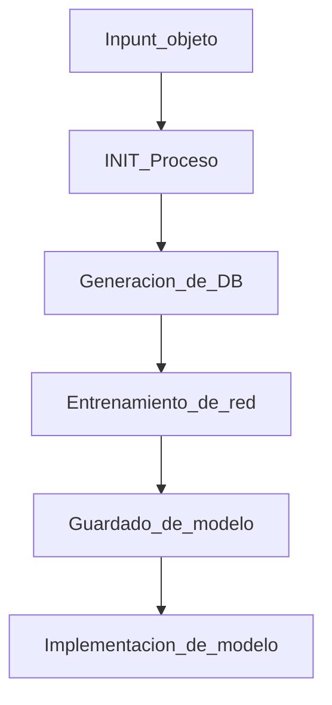

Proyecto propio de automatizacion del proceso de creacion de un modelo de vision computacional, inicialmente, en base a la red YOLO.

El objetivo del proyecto es en generar desde la base de datos necesaria hasta la implementacion del modelo por vision computacional,desde la base de que el modelo queda definido por el imput del objeto a ser identificado. para esto, el flujo de trabajo se presenta en el siguiente diagrama

