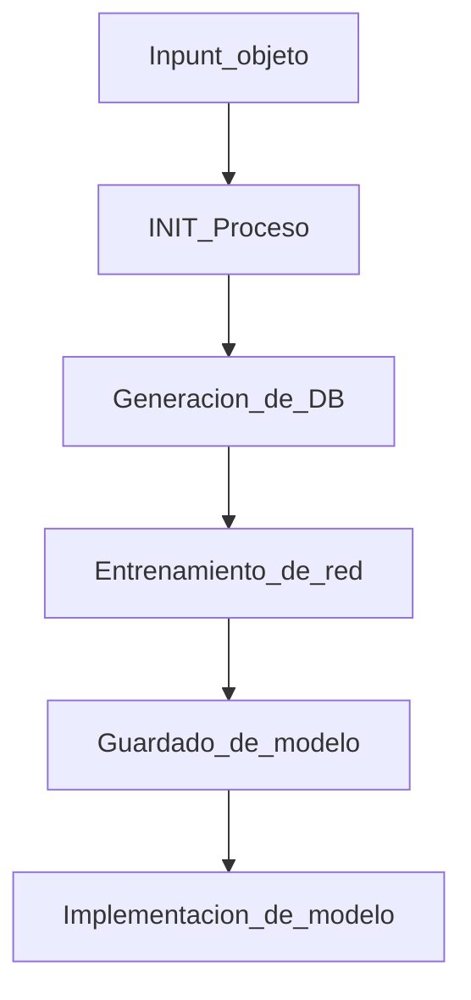

#  Identify by visual

Proyecto propio de automatizacion del proceso de creacion de un modelo de vision computacional, inicialmente, en base a la red YOLO.

El objetivo del proyecto es en generar desde la base de datos necesaria hasta la implementacion del modelo por vision computacional,desde la base de que el modelo queda definido por el imput del objeto a ser identificado. para esto, el flujo de trabajo se presenta en el siguiente diagrama

## Base de datos 

La generación de la base de datos es por un web scraping a partir de las herramientas más básicas posibles de trabajar en python, esto es utilizar código fuente en base a requests hacia la web. 

Si bien este enfoque puede ser en un inicio limitante para el crecimiento de la base de datos, dado el objetivo se ve que es un buen punto de partida. La escalabilidad quedará indicada en un futuro terminada la iteración.

## Entrenamiento de red

## Deploy
